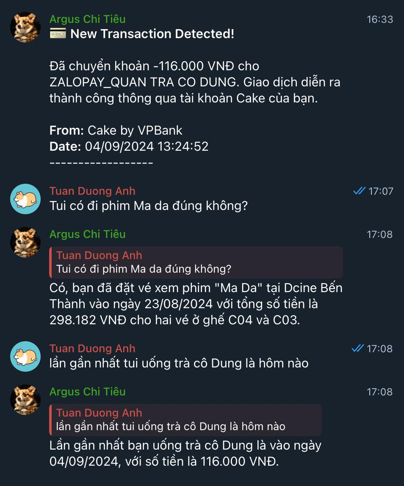

# Your personal accounting, managed by AI

`You ask, AI answer.`



## Flow

The transaction emails will be forwarded and processed by [Cloudflare Email Worker](https://developers.cloudflare.com/email-routing/email-workers/). They will by processed by OpenAI chat completion to extract the information (`amount`, `currency`, `description`,...) and then:
* Trigger the notification (to Telegram for now)
* Uploaded to the [vector database store](https://platform.openai.com/storage/vector_stores) of OpenAI platform.

When you send the message to your Telegram bot, it will call the Cloudflare worker (using Telegram's web hook), so you can query your transactions by [OpenAI Assistant](https://platform.openai.com/assistants).

## Setup

To set up the project, follow these steps:

1. **Install dependencies**:
   Make sure you have Node.js installed, then run:
   ```bash
   bun install
   ```

2. **Environment Configuration**:
   Create a `.env` file in the project root and configure the environment variables as described in the table below.

3. **Run the application**:
   ```bash
   bun run start
   ```
   or for development:
   ```bash
   bun run dev
   ```

## Environment Variables

The application requires the following environment variables:

| Variable Name                    | Description                                                              | Required | Default |
|----------------------------------|--------------------------------------------------------------------------|----------|---------|
| `TELEGRAM_CHAT_ID`               | The chat ID where the Telegram bot will send messages.                   | Yes      | -       |
| `TELEGRAM_BOT_TOKEN`             | Token for the Telegram bot.                                              | Yes      | -       |
| `OPENAI_PROJECT_ID`              | OpenAI project identifier.                                               | Yes      | -       |
| `OPENAI_API_KEY`                 | API key for accessing OpenAI services.                                   | Yes      | -       |
| `OPENAI_PROCESS_EMAIL_SYSTEM`    | System message to use for email processing in OpenAI.                    | Yes      | -       |
| `OPENAI_PROCESS_EMAIL_USER`      | User prompt template for email processing.                               | Yes      | -       |
| `OPENAI_PROCESS_EMAIL_MODEL`     | The model used by OpenAI for email processing.                           | Yes      | -       |
| `OPENAI_ASSISTANT_VECTOR_STORE`  | The vector store identifier for storing processed data in OpenAI.        | Yes      | -       |
| `OPENAI_ASSISTANT_ID`            | Assistant ID for OpenAI's thread execution.                              | Yes      | -       |

## Additional Information

- **Handling Email Data**: The application uses `PostalMime` for parsing email data and extracts relevant details for further processing.
- **Telegram Notifications**: Messages are sent to a specified chat using the `Telegraf` library, and markdown formatting is used for message content.
