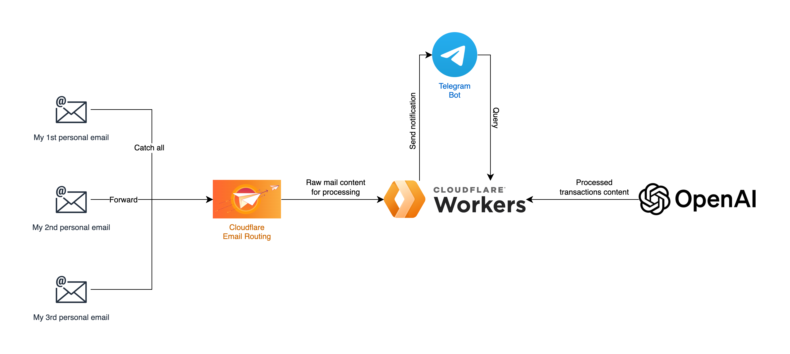

# Your personal accounting, managed by AI

`You ask, AI answer.`

**PersonalAccounting** centralizes receipt tracking by forwarding transaction emails from multiple accounts to one platform. It extracts key details, sends real-time notifications via Telegram, and lets users ask AI to look up receipts, generate summaries, or even provide daily financial reports, making personal accounting more efficient and automated.


## Worker flow

Transaction emails will be forwarded to a "virtual" email address managed by [Cloudflare Email Workers](https://developers.cloudflare.com/email-routing/email-workers/). These emails will then be processed by OpenAI's chat completion API to extract key information, such as the `amount`, `currency`, and `description`. After extracting the details, the workflow will:



1. Trigger a notification (currently set to send alerts via Telegram).
2. Upload the processed text to the [vector database store](https://platform.openai.com/storage/vector_stores) on the OpenAI platform.

Since the data is stored in a personal vector database, you can make queries by sending a message to your Telegram bot. The bot will then call the Cloudflare worker using a Telegram webhook. These "on-demand" requests will be processed by the [OpenAI Assistant](https://platform.openai.com/assistants).

## Prerequisite

* A domain hosted on Cloudflare, and don't have any email related DNS records: https://developers.cloudflare.com/email-routing/get-started/enable-email-routing/
* A paid (tier 1 and up) OpenAI account so you can use their `gpt-4o-mini` model: https://platform.openai.com/docs/guides/rate-limits/usage-tiers
* A Telegram bot to receive notification and send the queries: https://core.telegram.org/bots/tutorial 

## Setup

To set up the project, follow these steps:

1. **Install dependencies**:
   Make sure you have Node.js installed, then run:
   ```bash
   bun install
   ```

2. **Environment Configuration**:
   Create a `.env` file in the project root and configure the environment variables as described in the table below.

3. **Run the application**:
   ```bash
   bun run start
   ```
   or for development:
   ```bash
   bun run dev
   ```

## Environment Variables

The application requires the following environment variables:

| Variable Name                    | Description                                                              | Required | Default |
|----------------------------------|--------------------------------------------------------------------------|----------|---------|
| `TELEGRAM_CHAT_ID`               | The chat ID where the Telegram bot will send messages.                   | Yes      | -       |
| `TELEGRAM_BOT_TOKEN`             | Token for the Telegram bot.                                              | Yes      | -       |
| `TELEGRAM_BOT_SECRET_TOKEN`      | Secret token of the Telegram webhook (`X-Telegram-Bot-Api-Secret-Token`) | Yes      | -       |
| `OPENAI_PROJECT_ID`              | OpenAI project identifier.                                               | Yes      | -       |
| `OPENAI_API_KEY`                 | API key for accessing OpenAI services.                                   | Yes      | -       |
| `OPENAI_PROCESS_EMAIL_SYSTEM_PROMPT`    | System message to use for email processing in OpenAI.                    | Yes      | -       |
| `OPENAI_PROCESS_EMAIL_USER_PROMPT`      | User prompt template for email processing.                               | Yes      | -       |
| `OPENAI_ASSISTANT_SCHEDULED_PROMPT` | User prompt for daily transaction summary | Yes | - |
| `OPENAI_PROCESS_EMAIL_MODEL`     | The model used by OpenAI for email processing.                           | Yes      | -       |
| `OPENAI_ASSISTANT_VECTORSTORE_ID`| The vector store identifier for storing processed data in OpenAI.        | Yes      | -       |
| `OPENAI_ASSISTANT_ID`            | Assistant ID for OpenAI's thread execution.                              | Yes      | -       |

## Additional information

- **Handling Email Data**: The application uses `PostalMime` for parsing email data and extracts relevant details for further processing.
- **Telegram Notifications**: Messages are sent to a specified chat using the `Telegraf` library, and markdown formatting is used for message content.
