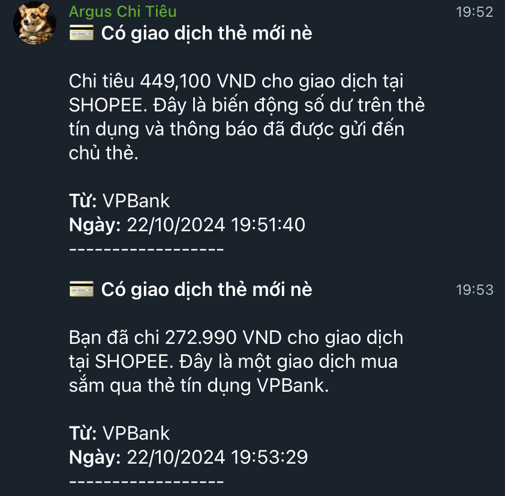
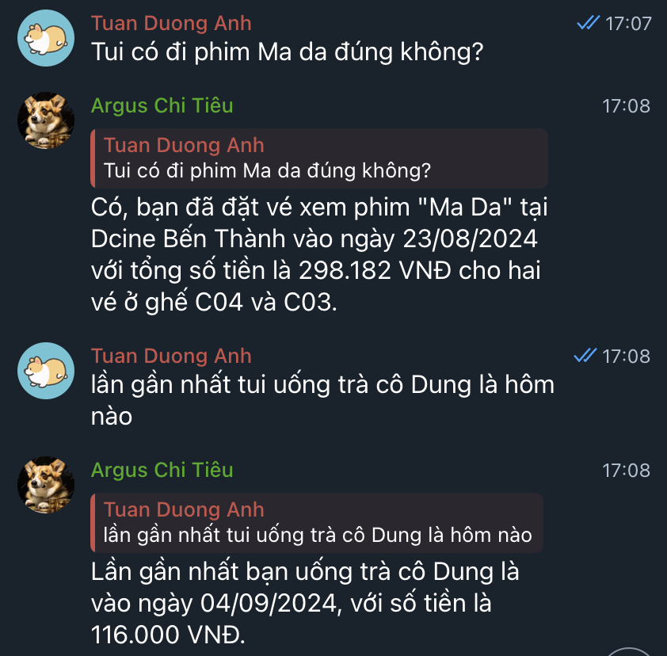
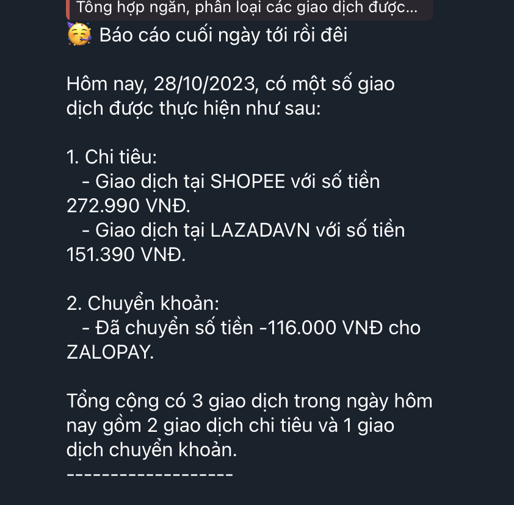
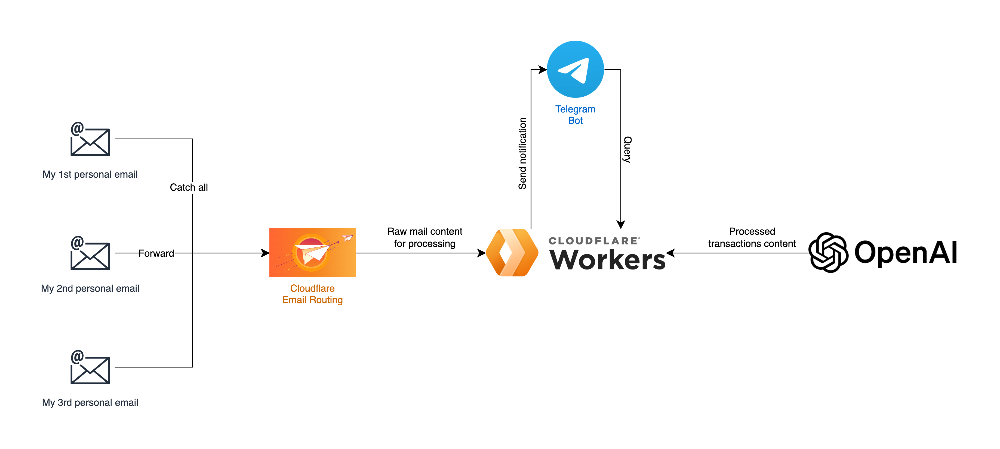

# Your personal accountant, managed by AI

`You ask, AI answer.`

**PersonalAccountant** centralizes receipt tracking by forwarding transaction emails from multiple accounts to one platform. It extracts key details, sends real-time notifications via Telegram, and lets users ask AI to look up receipts, generate summaries, or even provide daily financial reports, making personal accountant more efficient and automated.

*Disclaimer*:
The whole project is written and optimized by ChatGPT. Feel free to create issue if any and I will ask them to resolve it.

| | | |
|:-------------------------:|:-------------------------:|:-------------------------:|
| Notification |   Queries | Scheduled report |

## Application flow

Transaction emails will be forwarded to a "virtual" email address managed by [Cloudflare Email Workers](https://developers.cloudflare.com/email-routing/email-workers/). These emails will then be processed by OpenAI's Responses API to extract key information, such as the `amount`, `currency`, and `description`. After extracting the details, the workflow will:



1. Trigger a notification (currently set to send alerts via Telegram).
2. Upload the processed text to the [vector database store](https://platform.openai.com/storage/vector_stores) on the OpenAI platform.
3. Mirror the same transaction into a [Cloudflare D1](https://developers.cloudflare.com/d1/) table as structured rows.

The vector store remains the read path: questions asked through Telegram are still answered with file search. The D1 table is written in parallel so the structured data accumulates and can be verified before any query is switched over to it.

Since the data is stored in a personal vector database, you can make queries by sending a message to your Telegram bot. The bot will then call the Cloudflare worker using a Telegram webhook. These "on-demand" requests will be processed by the [OpenAI Responses API](https://platform.openai.com/docs/api-reference/responses) with file search over the configured vector store.

## Prerequisite

* A domain hosted on Cloudflare, and don't have any email related DNS records: https://developers.cloudflare.com/email-routing/get-started/enable-email-routing/
* A paid OpenAI account so you can use the configured OpenAI models: https://platform.openai.com/docs/guides/rate-limits/usage-tiers
* A Telegram bot to receive notification and send the queries: https://core.telegram.org/bots/tutorial 

## Setup

To set up the project, follow these steps:

1. **Install dependencies**:
   Make sure you have Node.js installed, then run:
   ```bash
   bun install
   ```

2. **Environment Configuration**:
   Create a `.env` file in the project root and configure the environment variables as described in the table below.

3. **Run the application**:
   ```bash
   bun run start
   ```
   or for development:
   ```bash
   bun run dev
   ```

## Environment Variables

The application requires the following environment variables:

| Variable Name                    | Description                                                              | Required | Default |
|----------------------------------|--------------------------------------------------------------------------|----------|---------|
| `TELEGRAM_CHAT_ID`               | The chat ID where the Telegram bot will send messages.                   | Yes      | -       |
| `TELEGRAM_BOT_TOKEN`             | Token for the Telegram bot.                                              | Yes      | -       |
| `TELEGRAM_BOT_SECRET_TOKEN`      | Secret token of the Telegram webhook (`X-Telegram-Bot-Api-Secret-Token`) | Yes      | -       |
| `OPENAI_PROJECT_ID`              | OpenAI project identifier.                                               | Yes      | -       |
| `OPENAI_API_KEY`                 | API key for accessing OpenAI services.                                   | Yes      | -       |
| `OPENAI_PROCESS_EMAIL_SYSTEM_PROMPT`    | System message to use for email processing in OpenAI.                    | Yes      | -       |
| `OPENAI_PROCESS_EMAIL_USER_PROMPT`      | User prompt template for email processing.                               | Yes      | -       |
| `OPENAI_ASSISTANT_SCHEDULED_PROMPT` | User prompt for daily transaction summary | Yes | - |
| `OPENAI_PROCESS_EMAIL_MODEL`     | The model used by OpenAI for email/manual transaction processing.         | Yes      | `gpt-5.6-luna` |
| `OPENAI_OCR_MODEL`               | The vision model used to extract receipt text from Telegram images.       | No       | `gpt-5.6-luna` |
| `OPENAI_ASSISTANT_MODEL`         | The Responses API model used for transaction questions and report runs.   | No       | `gpt-5.6-luna` |
| `OPENAI_ASSISTANT_ROUTER_MODEL`  | The model used to route Telegram messages to assistant functions.         | No       | `gpt-5.6-luna` |
| `OPENAI_ASSISTANT_VECTORSTORE_ID`| The vector store identifier for storing processed data in OpenAI and answering questions with file search. | Yes      | -       |
| `TRANSACTION_DUPLICATE_WINDOW_MINUTES` | Minutes either side of a transaction to look for the same payment reported by a second sender. | No | `15` |

## Structured transaction store

Transactions are mirrored into a D1 database alongside the vector store upload. Create the database and apply the migration:

```bash
bunx wrangler d1 create personalaccountant
# copy the returned database_id into the d1_databases block in wrangler.jsonc
bunx wrangler d1 migrations apply personalaccountant --remote
```

The schema keeps amounts as integers in minor units, records the merchant-side amount separately when a bank settles a foreign charge in another currency, and freezes the exchange rate used at the time a transaction is recorded so historical reports do not drift. A `transactions_fts` FTS5 index covers the free-text columns with diacritics folded, so untoned Vietnamese queries still match.

Two kinds of duplicate are handled differently:

* **Delivery retries** — the same email or webhook arriving twice is dropped by a unique constraint.
* **One payment, two senders** — a merchant receipt and the matching bank debit arrive minutes apart. The second row is kept but linked to the first through `duplicate_of`, so both remain queryable while totals count the payment once. A debit paired with a credit is treated as a transfer between accounts rather than a duplicate.

Writes to D1 are best-effort: a failure is logged and does not interrupt notification or the vector store upload. If no `DB` binding is configured, the structured write is skipped entirely.

A daily job refreshes exchange rates and fills in any transaction recorded while no rate was available, converting each row with the rate for its own date. A transaction is never blocked on an exchange rate lookup.

## TODO
- [ ] Whitelist email addresses.
- [ ] Notify to channel, group chat instead
- [ ] Switch the query path from vector store file search to the structured store

## Additional information

- **Handling Email Data**: The application uses `PostalMime` for parsing email data and extracts relevant details for further processing.
- **Telegram Notifications**: Messages are sent to a specified chat using the `Telegraf` library, and markdown formatting is used for message content.
